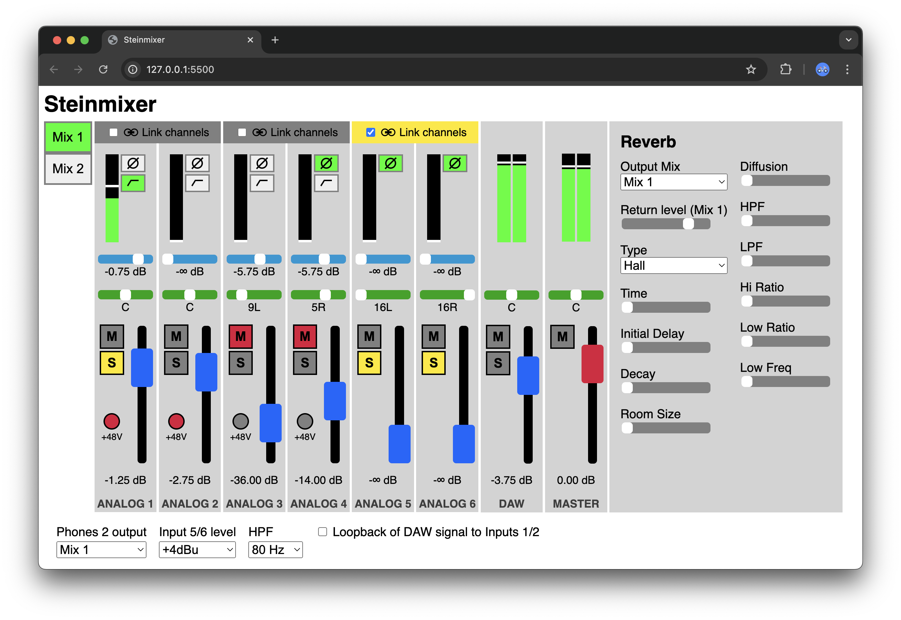

# Steinmixer

A website to control the Steinberg UR44 audio interface.

# Why?

Steinberg audio interfaces come with an application called "dspMixFX" that is
able to control the interface's mixing and routing cababilities which go
beyond the class-compliant features of an USB audio device. Unfortunately,
the application is not available for Linux, and requires the installation of
a kernel extension on macOS, which is not recommended anymore for security
reasons.
However, the interface can be controlled via MIDI SysEx messages.
This website uses the Web MIDI API to produce and receive such messages to
communicate with the interface.
Currently, only Steinberg UR44 (not C) is supported, as I don't have other
models to test with. However, it should be straight-forward to adapt this tool.

# Features and missing features
✅ What is possible:

- Volume control, mute, soloing all analog inputs, DAW and Main channels.
- Gain metering of all channels
- Save and recall 2 independent mixes
- Loopback
- Highpass filter on inputs
- Phase inversion on inputs

❌ What is not (yet) possible:

- Send and return effects (reverb, delay)
- Stereo linking of channels

# Deploy & Develop

The app is written in plain JavaScript. There is no build step required.
To deploy, just copy the files of the `web` folder to your webspace.
To develop, run a local web server with `npm run start`.

# Acknowledgements

The development of Steinmixer was made significantly easier thanks to the work
of GitHub user [askoriy](https://github.com/askoriy) in
[urcontrol](https://github.com/askoriy/urcontrol).
